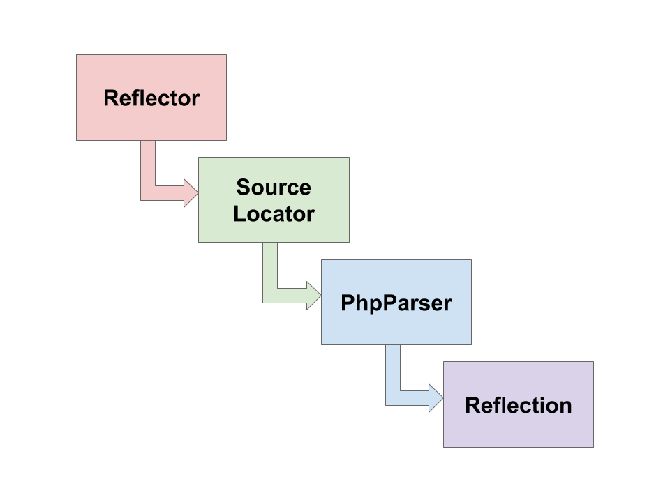

# How does Better Reflection work?

## 1. Reflector

There are two "entry points" to begin using Better Reflection. The first is the static constructors on the `Reflection*`
classes:

 - `ReflectionClass::createFromName(string $name)`
 - `ReflectionClass::createFromInstance(object $instance)`
 - `ReflectionMethod::createFromName(string $className, string $methodName)`
 - `ReflectionMethod::createFromInstance(object $instance, string $methodName)`
 - `ReflectionParameter::createFromClassNameAndMethod(string $className, string $methodName, string $parameterName)`
 - `ReflectionParameter::createFromClassInstanceAndMethod(object $instance, string $methodName, string $parameterName)`
 - `ReflectionParameter::createFromSpec([string $className, string $methodName], string $parameterName)`
 - `ReflectionParameter::createFromSpec([object $instance, string $methodName], string $parameterName)`
 - `ReflectionParameter::createFromSpec(string $functionName, string $parameterName)`
 - `ReflectionProperty::createFromName(string $className, string $propertyName)`
 - `ReflectionProperty::createFromInstance(object $instance, string $propertyName)`

Using these is documented in a bit more detail within the [Usage documentation](usage.md#initialisers). These methods
use a default set of Source Locators:

 * `PhpInternalSourceLocator`
 * `EvaledCodeSourceLocator`
 * `AutoloadSourceLocator`

The second entry point is the `ClassReflector` and `FunctionReflector` objects, to which you must provide specific
instructions on how Better Reflection is to find code, in the form of the Source Locators.

## 2. Source Locators

Source Locators are pretty much as the name implies - they are instructions on finding source code for Better Reflection
to examine to create the reflections. A detailed list of each source locator and how they work can be found in the
[Usage documentation - Source Locators section](usage.md#sourcelocators). 

## 3. PhpParser

Using Nikita Popov's [PHP-Parser library](https://github.com/nikic/PHP-Parser), the source code located by the Source
Locators is loaded into an [AST format](https://en.wikipedia.org/wiki/Abstract_syntax_tree), forming the core foundation
on which the reflection is based. Using the AST, we are able to examine the structure of the code, finding out things
like what methods and properties are on a class, and what parameters belong to a method or function and so on. We are
also able to analyse types defined in DocBlocks using [phpDocumentor/TypeResolver](https://github.com/phpDocumentor/TypeResolver)
to add context with namespaces and so on.

## 4. Reflection

Internally to the `Reflection*` classes in Better Reflection, we simply hold the AST as the main property. All
reflection, analysis and modification is done directly to this AST. Therefore it is possible to unparse or export the
AST back into code - and thus execute monkey patched code.
